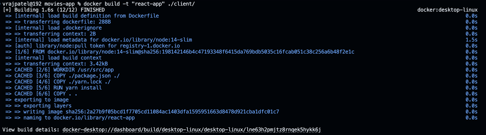

# Cloud Computing
# 21BCP362 G-11 , Div-6 , Sem-6

## Problem Statement:
Create any three-tier application using Docker, using a multi-container setup. Build at least one docker image using Dockerfile. You are free to use your old projects, build new projects or take any project from GitHub. However, if you are using a project from Github, properly cite the original author of the code in your blog. 

## Steps 

1. Get a sample 3-tier project. <br>
    Here, I have cloned this MERN stack project from github.
    ``` https://github.com/samaronybarros/movies-app ```
    

2. After cloning, we have to create two separate ``` Dockerfile ``` for each ``` client ``` & ``` server ```. <br>
We wil use ``` docker compose ``` to create a multi-container setup.

3. Add the below code in ``` client/Dockerfile ```
    ```Dockerfile 
    FROM node:14-slim
    WORKDIR /usr/src/app 
    COPY ./package.json ./ 
    COPY ./yarn.lock ./ 
    RUN yarn install 
    COPY . . 
    EXPOSE 3000 
    CMD [ "yarn", "start" ] 
    ```
    <b>NOTE:</b> remove "PORT=8000" section from start script in package.json. <br>
    it should look something like this:
    ```json
    "scripts": {
    "start": "react-scripts start",
    "build": "react-scripts build",
    "test": "react-scripts test",
    "eject": "react-scripts eject"
    },
    ```

4. Similarly, create a Dockerfile in ``` server/Dockerfile ``` 
    ```Dockerfile 
    FROM node:14-slim
    WORKDIR /usr/src/app
    COPY ./package.json ./
    COPY ./yarn.lock ./
    RUN yarn install
    COPY . .
    EXPOSE 5500
    CMD [ "index.js" ] 
    ```
    <b>NOTE:</b> change the port number in ``` server/index.js ```
    ```js
    const apiPort = 5500
    ```

5. create a ``` docker-compose.yml ``` in the root directory of the project.
    ```docker
    version: "3"
    services:
    react-app:
        image: react-app
        stdin_open: true
        ports: 
        - "3000:3000"
        networks:
        - mern-app
    api-server:
        image: api-server
        ports:
        - "5500:5500"
        networks:
        - mern-app
        depends_on:
        - mongo
    mongo:
        image: mongo
        ports:
        - "27017:27017"
        networks:
        - mern-app
        volumes:
        - mongo-data:/data/db
    networks:
    mern-app:
        driver: bridge
    volumes:
    mongo-data:
        driver: local
    ```

6. Add changes to the following files:
    1. ``` client/src/api/index.js ```
        ```js
        const api = axios.create({
        baseURL: 'http://localhost:5500/api',
        })
        ```
    2. ``` server/db/index.js ``` <br>
        instead of localhost, use mongo in the connection string as we as made a service named mongo in docker-compose.yml.
        ```js
        const connectionString = 'mongodb://mongo:27017/new-cinema';
        ```

7. Open terminal in the root directory of your folder and run these docker commands: <br>
    1. ```bash 
        docker build -t "react-app" ./client/ 
        ```
        
        docker desktop:
        

    2. ```bash
        docker build -t "api-server" ./server/  
        ```
        
        docker desktop:
        

    3. ```bash
        docker pull mongo:latest
        ```
        

8. Now we use Docker Compose to run stack of containers.
    ```bash
    docker-compose up -d
    ```
    <br>

    <b>Docker Desktop</b>
    

    

    

    

    

9. Test on localhost.
    

    

    

10. Verify on MongoDB Compass
    

11. Push Images to DockerHub
    

    

    